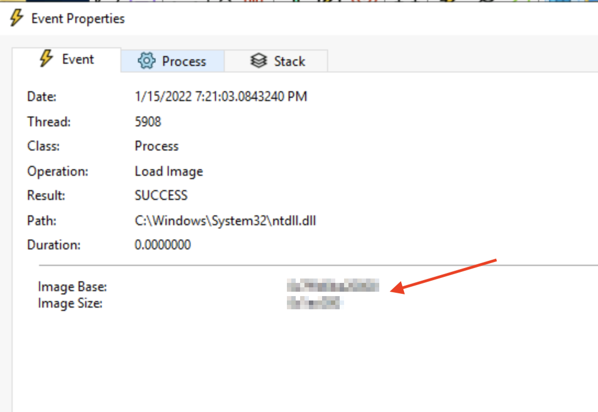

# Windows Internals

https://tryhackme.com/room/windowsinternals

目的:
- Windows のプロセスとその基盤技術を理解し、触れてみる。
- コアとなるファイル フォーマットとその使用方法について学ぶ。
- Windows の内部構造に触れ、カーネルの動作を理解する。

## Task 2 - プロセス

ここではプロセス モニターを使用してプロセスの情報を確認するというタスクを実施します。

*Open the provided file: "Logfile.PML" in Procmon and answer the questions below.*

デスクトップの ProcessMonitor フォルダの下に Logfile.PML という名前のファイルがあるのでこれを開くのですが、Procmon とのファイル関連付けがされていないので、Procmon を起動して "File" - "Open" から開くか、一度 Procmon を起動した後に Logfile.PML ファイルをダブルクリックしてログ ファイルを開きます。

*What is the process ID of "notepad.exe"?*

メニューの "Filter" - "Filter" を選択するか、漏斗のアイコンをクリックして Filter ダイアログを表示させます。
そして次のようなエントリを追加します ("Add" ボタンを押すこと!)。

- Process Name
- is
- notepad.exe
- Include


そうすると notepad.exe のログだけが表示され、`PID 列をみると notepad.exe のプロセス ID がわかります。


*What is the parent process ID of the previous process?*

notepad.exe のログであればどれでもいいのですが、例えば一番先頭の `Process Start` をダブルクリックします。

表示されたダイアログの `Process` タブをクリックし、`Parent PID` 欄をみると、親プロセスの ID がわかります。


*What is the integrity level of the process?*

先ほどのダイアログの `Integrity` 欄みると整合性レベルがわかります。

通常は、ユーザーが普通にプロセスを起動した場合の整合性レベルは「中」 (ストア アプリなどは別)、管理者として実行したり Administrator ユーザーがプロセスを起動した場合は「高」になります。

参考:
- [必須整合性制御](https://learn.microsoft.com/ja-jp/windows/win32/secauthz/mandatory-integrity-control)

## Task 3 - スレッド

*What is the thread ID of the first thread created by notepad.exe?*

スレッドが作成されると `Thread Create` のイベントが出ます。
一番最初の `Thread Create` のイベントの `Detail` 欄に表示されているスレッド ID が回答になります。


*What is the stack argument of the previous thread? *

スタック アーギュメントが何かわからないのですが、前の問題の回答のスレッドを作成したスレッドの ID を答えれば良いようです。

`Thread Create` のイベントをダブルクリックし、`Event` タブの `Thread` 欄をみると、呼び出し元スレッドの ID を確認することができます。


## Task 4 - Virtual Memory

*What is the total theoretical maximum virtual address space of a 32-bit x86 system?*

Windows 11 にはもう x86 版 (32bit 版) はありませんが、以前のバージョンの Windows には x86 版があり、その仮想アドレス空間のサイズは 4GB です。

- [仮想アドレス空間（メモリ管理）](https://learn.microsoft.com/ja-jp/windows/win32/memory/virtual-address-space)

*What default setting flag can be used to reallocate user process address space?*

これは「x86 版 Windows の仮想アドレス空間のユーザーモードの既定のサイズは 2GB だが、サイズを増やすためのフラグは何か」という質問のようです。

BCDEdit を使って `increaseuserva` オプションを設定すると、最大 3GB までユーザーモードのサイズを増やすことができます。全体で 4GB なのは変わりないので、その分システムで使用できるサイズは減ります。

- [4 GB のチューニング: BCDEdit と Boot.ini](https://learn.microsoft.com/ja-jp/windows/win32/memory/4-gigabyte-tuning)

*What is the base address of "notepad.exe"?*

`C:\Windows\System32\notepad.exe` の `Load Image` のイベントをダブルクリックして開くと、`Image Base` 欄に notepad.exe がロードされた仮想アドレス空間上のアドレス (ベース アドレス) が確認できます。


## Task 5 - Dynamic Link Libraries

*What is the base address of "ntdll.dll" loaded from "notepad.exe"?*

`ntdll.dll` の `Load Image` のイベントをダブルクリックして開くと、`Image Base` 欄に ntdll.dll がロードされた仮想アドレス空間上のアドレス (ベース アドレス) が確認できます。



*What is the size of "ntdll.dll" loaded from "notepad.exe"?*

同じダイアログで `Image Size` 欄をみると、ntdll.dll のロードされたサイズがわかります。

*How many DLLs were loaded by "notepad.exe"?*

notepad.exe のイベントのみを表示するフィルターに加えて、モジュールのイベントのみを表示する次のフィルターも追加しました。

- Operation
- is
- Load Image
- Include

追加するとウィンドウの左下に表示されているイベントの数が表示されます。


しかし、表示されているイベントをみると拡張子が DLL 以外のファイル、`notepad.exe` と `winspool.drv` もあるので、2 つ減らした値が答えになります (`winspool.drv` も DLL ではないかと思いますが、、)。

## Task 6 - Portable Executable Format

*What PE component prints the message "This program cannot be run in DOS mode"?*

"DOS Stub"

Windows における実行可能ファイルの先頭には MS-DOS 2.0 互換のヘッダーがあり、その後ろに MS-DOS でプログラムが実行されたときに呼び出されるスタブ プログラムが記述されています。通常 Visual Studio でビルドすると、メッセージ "This program cannot be run in DOS mode" を出力する既定のスタブ プログラムが埋め込まれます。

- [A dive into the PE file format - PE file structure - Part 2: DOS Header, DOS Stub and Rich Header
](https://0xrick.github.io/win-internals/pe3/)
- [/STUB (MS-DOS スタブ ファイル名)](https://learn.microsoft.com/ja-jp/cpp/build/reference/stub-ms-dos-stub-file-name?view=msvc-170)
- [MS-DOS v1.25,v2.0,v4.0 Source Code](https://github.com/microsoft/MS-DOS/tree/main)

*What is the entry point reported by DiE?*

デスクトップ上のフォルダ `die_win64_portable_3.03` 内の `die.exe` を起動します。次に、ウィンドウ右上にある3点リーダーをクリックして、`C:\Windows\system32\notepad.exe` を開きます。

`Entry point` 欄をみると答えがわかります。


*What is the value of "NumberOfSections"?*

同じ画面の `Sesions` 欄をみると答えがわかります。もしくはウィンドウ左中央部分の `PE` ボタンをクリックして PE ウィンドウを表示し、`IMAGE_NT_HEADERS` - `IMAGE_FILE_HEADER` の `NumberOfSections` のところを見ることによっても確認できます。


*What is the virtual address of ".data"?*

PE ウィンドウの `Secions` をみると、`.data` セクションの仮想アドレスがわかります。


*What string is located at the offset "0001f99c"?*

PE ウィンドウの `Strings` にオフセットと文字列の一覧が表示されるので、`0001f99c` を探します。


## Task 7 - Interacting with Windows Internals

*Enter the flag obtained from the executable below.*

これは単にコマンド プロンプトを開いて `inject-poc.exe` を実行すると答えがわかります。


同じフォルダ内にソース ファイルがあります。
中を見てみると、次のような処理を行なっています。

1. [`VirtualAlloc`](https://learn.microsoft.com/ja-jp/windows/win32/api/memoryapi/nf-memoryapi-virtualalloc) でメモリを割り当てる。このとき第4引数には `PAGE_EXECUTE_READWRITE` を指定し、実行可能にしています。
2. `VirtualAlloc` は割り当てられた領域のベース アドレスを返すので、そこに `memcpy` で実行したいコード (`shellcode`) をコピーします。
3. `((void(*)())lpAlloc)()` で割り当てられたアドレスをコールしてシェル コードを実行します。

```cpp
#include <windows.h>

int main()
{

        const char* shellcode = \
                "\xd9\xeb\x9b\xd9\x74\x24\xf4\x31\xd2\xb2\x77\x31\xc9\x64\x8b"
                "\x71\x30\x8b\x76\x0c\x8b\x76\x1c\x8b\x46\x08\x8b\x7e\x20\x8b"
                "\x36\x38\x4f\x18\x75\xf3\x59\x01\xd1\xff\xe1\x60\x8b\x6c\x24"
                "\x24\x8b\x45\x3c\x8b\x54\x28\x78\x01\xea\x8b\x4a\x18\x8b\x5a"
                "\x20\x01\xeb\xe3\x34\x49\x8b\x34\x8b\x01\xee\x31\xff\x31\xc0"
                "\xfc\xac\x84\xc0\x74\x07\xc1\xcf\x0d\x01\xc7\xeb\xf4\x3b\x7c"
                "\x24\x28\x75\xe1\x8b\x5a\x24\x01\xeb\x66\x8b\x0c\x4b\x8b\x5a"
                "\x1c\x01\xeb\x8b\x04\x8b\x01\xe8\x89\x44\x24\x1c\x61\xc3\xb2"
                "\x08\x29\xd4\x89\xe5\x89\xc2\x68\x8e\x4e\x0e\xec\x52\xe8\x9f"
                "\xff\xff\xff\x89\x45\x04\xbb\x7e\xd8\xe2\x73\x87\x1c\x24\x52"
                "\xe8\x8e\xff\xff\xff\x89\x45\x08\x68\x6c\x6c\x20\x41\x68\x33"
                "\x32\x2e\x64\x68\x75\x73\x65\x72\x30\xdb\x88\x5c\x24\x0a\x89"
                "\xe6\x56\xff\x55\x04\x89\xc2\x50\xbb\xa8\xa2\x4d\xbc\x87\x1c"
                "\x24\x52\xe8\x5f\xff\xff\xff\x68\x6f\x78\x58\x20\x68\x61\x67"
                "\x65\x42\x68\x4d\x65\x73\x73\x31\xdb\x88\x5c\x24\x0a\x89\xe3"
                "\x68\x32\x7d\x58\x20\x68\x68\x31\x4e\x47\x68\x48\x33\x5f\x37"
                "\x68\x6c\x4c\x5f\x37\x68\x63\x37\x5f\x34\x68\x31\x4e\x6a\x33"
                "\x68\x54\x48\x4d\x7b\x31\xc9\x88\x4c\x24\x1a\x89\xe1\x31\xd2"
                "\x52\x53\x51\x52\xff\xd0\x31\xc0\x50\xff\x55\x08";

        printf("shellcode length: %i", strlen(shellcode));

        LPVOID lpAlloc = VirtualAlloc(0, 4096, MEM_COMMIT, PAGE_EXECUTE_READWRITE);
        memcpy(lpAlloc, shellcode, strlen(shellcode));

        ((void(*)())lpAlloc)();

        return 0;
}
```
