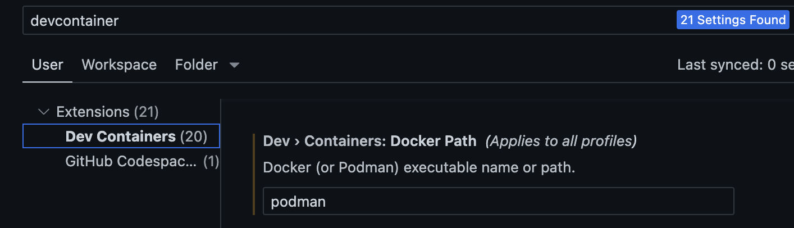

# Podman で Dev Container を使う時のあれこれ

Docker と異なり、Podman で Dev Container を使う時には色々はまるポイントがあります。

## Docker Path の設定

Dev Container が使う CLI を `podman` にするために、設定の `Dev > Containers: Docker Path` の値を `docker` から `podman` に変更します。



## Dev Container の起動失敗 (その 1)

`Dev Containers: Add Dev Container Configuration Files...` で例えば次のような `.devcontainer/devcontainer.json` ファイルを生成し、`Reopen in Container` をクリックすると、エラーになります。

```json
{
	"name": "Go",
	// Or use a Dockerfile or Docker Compose file. More info: https://containers.dev/guide/dockerfile
	"image": "mcr.microsoft.com/devcontainers/go:1-1.23-bookworm"
}
```

ログを見ると、後半部分に次のようなメッセージが出ています。

```
...
[2025-02-15T12:36:26.953Z] Start: Run in container: mkdir -p '/root/.vscode-server/bin' && ln -snf '/vscode/vscode-server/bin/linux-arm64/33fc5a94a3f99ebe7087e8fe79fbe1d37a251016' '/root/.vscode-server/bin/33fc5a94a3f99ebe7087e8fe79fbe1d37a251016'
[2025-02-15T12:36:26.954Z] 
[2025-02-15T12:36:26.954Z] mkdir: cannot create directory '/root': Permission denied
[2025-02-15T12:36:26.954Z] Exit code 1
[2025-02-15T12:36:26.954Z] Stop (1 ms): Run in container: mkdir -p '/root/.vscode-server/bin' && ln -snf '/vscode/vscode-server/bin/linux-arm64/33fc5a94a3f99ebe7087e8fe79fbe1d37a251016' '/root/.vscode-server/bin/33fc5a94a3f99ebe7087e8fe79fbe1d37a251016'
[2025-02-15T12:36:26.956Z] Command in container failed: mkdir -p '/root/.vscode-server/bin' && ln -snf '/vscode/vscode-server/bin/linux-arm64/33fc5a94a3f99ebe7087e8fe79fbe1d37a251016' '/root/.vscode-server/bin/33fc5a94a3f99ebe7087e8fe79fbe1d37a251016'
[2025-02-15T12:36:26.956Z] mkdir: cannot create directory '/root': Permission denied
[2025-02-15T12:36:26.956Z] Exit code 1
```

以下の GitHub の Issue に同様の報告がありました。

- [Podman: .vscode-server directory creation in wrong place when remoteUser is defined #4443](https://github.com/microsoft/vscode-remote-release/issues/4443)

これで回避できた、できないというコメントが複数ありますが、手元の環境では次のように `devcontainer.json` に `"containerUser": "vscode"` を追加することで解消されました。

```json
// For format details, see https://aka.ms/devcontainer.json. For config options, see the
// README at: https://github.com/devcontainers/templates/tree/main/src/go
{
	"name": "Go",
	// Or use a Dockerfile or Docker Compose file. More info: https://containers.dev/guide/dockerfile
	"image": "mcr.microsoft.com/devcontainers/go:1-1.23-bookworm",

	"containerUser": "vscode"
}
```
